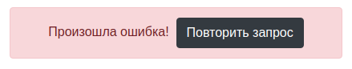

# 12. Домашнее задание к лекции «Redux Observable»

[[GithubPages](https://igor-chazov.github.io/ra-hw-12_observable_2-main-details)]

---

## 12.2 Список и подробности

Напишите проект, использующий React Router и Redux Observable, который удовлетворяет следующим условиям:

1. На главной странице показывается список услуг (редактирование не нужно, достаточно просто ссылок) - данные загружаются методом GET на http://localhost:7070/api/services
1. При переходе по ссылке (/:id/details), загружаются детали услуги - GET на http://locahost:7070/api/services/:id

При загрузке должен отображаться индикатор загрузки (что на странице списка, что на странице деталей):

При ошибке - показываться сообщение об ошибке и кнопка "Повторить запрос", при нажатии на которой осуществляется попытка снова выполнить запрос (с индикатором загрузки и т.д.):

Готовый бэкенд расположен в каталоге `backend`.

---